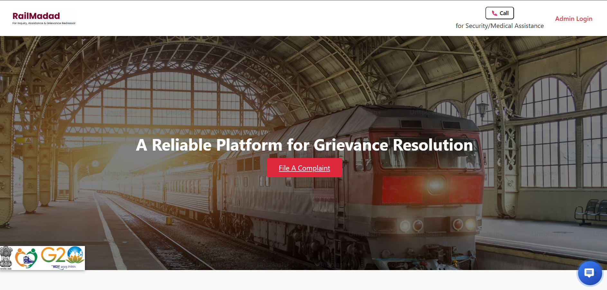
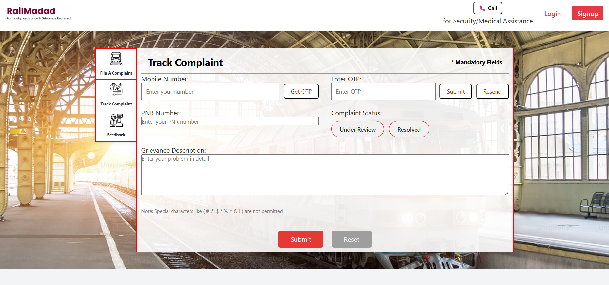
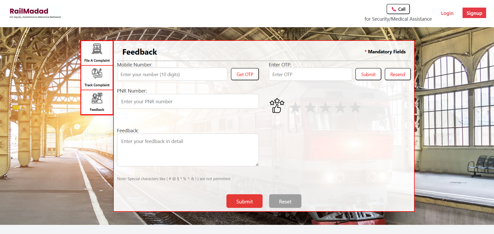

 # RailMadad – Intelligent Railway Grievance Redressal System

 RailMadad is a smart web-based grievance redressal platform designed to simplify and accelerate complaint handling for Indian Railways. It allows passengers to file complaints, track their status, and provide feedback — all while enabling administrators to categorize, prioritize, and resolve grievances effectively using AI.

 ✅ Backend Setup (Node.js + MySQL)
To run the backend, first open your terminal and navigate to the railmadad-backend directory. Start the server by running the command node server.js. Make sure your MySQL service is running in the background. Once started, the backend will be up and connected to the MySQL database.

✅ MySQL Database Setup
First, open your MySQL client (CLI or GUI like MySQL Workbench) and create a database named railmadad. Inside this database, create two tables named complaints and feedback. These names are case-sensitive, so they must match exactly. The complaints table stores user-submitted complaints, while the feedback table records post-resolution feedback. Make sure all the column names also match what's expected in the backend code to avoid any connection or data errors.

## 📸 Screenshots

### 🏠 Home Page

### 📝 File a Complaint

### 📍 Track Complaint

### 🧑‍💻 Admin Portal

### ⭐ Feedback Section

